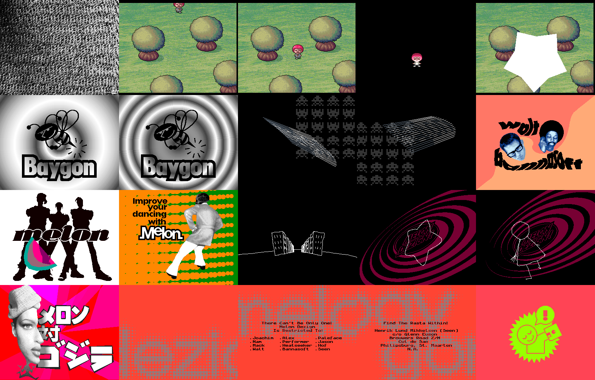

# Baygon — in a browser

**▶ [Watch it in your browser](https://gmegidish.github.io/demoports/Baygon_by_Melon_Dezign/)** · press **F** for fullscreen

*Baygon* is a demo by Melon Dezign, released for the Amiga 1200 in 1995. One disk, four and a half minutes: a walk through a mushroom field, a bee, a logo made of scanlines over space invaders, pictures by Walt, a 3D melon slice, a dancer, four pencil animations over a spiral, a poster, and thirteen pages of credits that end by rebooting the machine.

This repository rebuilds it in a browser. The original disk image is loaded into two megabytes of chip RAM, exactly where the Amiga's loader put it, and the demo's 68000 code is ported routine by routine to JavaScript that works on that memory. A small model of the chipset turns the result into a picture: the blitter, the copper, eight bitplanes and the 24-bit palette. A 2D canvas puts it on screen. No WebGL, no libraries, no CPU emulator. Same disk, same music, same frame counts.

There is no source code for Baygon. Everything below was read out of the disk.

The whole port was written by [Claude Code](https://claude.com/claude-code): unpacking the disk, disassembling the ten parts, porting them, measuring a capture of the original, and this README.



*Twenty moments, in order. Rendered headless by `tools/poster.mjs`: no browser, no screenshots.*

## Run

```bash
python3 -m http.server 8000
# open http://localhost:8000/
```

## Controls

| Key | Action |
|---|---|
| Click | Start |
| **F** | Toggle fullscreen |
| ← / → | Seek 5 s |

Add `#t=42` to the URL to start at 42 s. Add `#hud` to show the clock.

## Credits

*Baygon* by Melon Dezign, Amiga AGA, 1995. From the demo's own credits:

| Role | Authors |
|---|---|
| Code | Bannasoft |
| Design and graphics | Walt |
| Music | "Back To School", performed by Tongue Twista |
| Melon Dezign | Joachim, Alex, Paleface, Nam, Performer, Jason, Mack, Heatseeker, Hof, Walt, Bannasoft, Seen |

All graphics and music belong to their authors. This repository re-hosts the original disk untouched, and the music rendered to a format a browser can play.

The port, the tools and this README: written by [Claude Code](https://claude.com/claude-code).

---

# How it was made, and how it was unmade

## One file, 506,230 bytes

`MD-Baygon.DMS` is the demo as it travelled: a DiskMasher archive, the Amiga scene's format for a floppy. Eighty tracks, each compressed on its own with "heavy2", the LZH mode. `tools/undms.c` unpacks it with the public-domain xDMS decoders [3] into an 880 KB disk image, `assets/baygon.adf`. Every track's checksum matches.

The disk has no filesystem. It starts like this:

```
00000000: 444f 5300 7bf7 2766 0000 0370 3039 00df   DOS.{.'f...p09..
00000010: f07c 0c00 00f8 6640 70ff 41f9 0010 0000   .|....f@p.A.....
```

A boot block. `3039 00dff07c` reads `DENISEID`, `0c00 00f8` compares it with `$f8`: the AGA Lisa chip. Then it writes to `$100000` and reads it back, for two megabytes of chip RAM. Anything else gets a screen that flashes the colour of the beam position, forever. Then it asks `trackdisk.device` for `$ba00` bytes from byte `$400` of the disk, and jumps there.

## The loader

That code copies itself to `$2000` and shows a picture of noise, four bitplanes of it, with a small "melon" in the corner. While it is on screen, the loader reads the rest of the disk with its own MFM track reader straight off the drive: `$ce667` bytes, from disk offset `$bd80`, to address `$d980`. All of it, in one go. The noise stays for as long as the drive takes: tens of seconds on a real one, 3.7 s in the capture, which was made with a fast drive. The port shows it for 3.7 s.

Then everything is in memory:

| Address | What |
|---|---|
| `$d980` | The music module, 274,916 bytes |
| `$50b68` | Bee and rings |
| `$551a0` | Scanline logo and invaders |
| `$58038` | Dancing |
| `$65338` | Poster |
| `$70110` | Pencil animations |
| `$b9ea8` | Melon slice |
| `$be518` | Credits |
| `$c6da8` | A routine the loader installs into Kickstart's reset vector |
| `$c96e8` | Walt, crunched |
| `$d3a68` | Mushrooms, crunched |

The loader starts the music, fades the noise to black over 33 frames, and calls the parts one after another:

```asm
lea     $d3a68,a0       ; mushrooms
bsr     call_part
lea     $50b68,a0       ; bee and rings
...
```

`call_part` points the copper at a blank list, puts `$168000` into `A5`, the scratch space every part uses, and jumps. Each part returns with `rts`. Before the bee the loader sets the blank list's colour to white, and the bee's precalculation happens on a white screen; the port does the same, which is why the screen flashes white at 17 s.

After the last part the loader turns the music's four volume registers down one step per frame, 64 frames, stops the replayer, and jumps to the credits. The credits never return.

## Two parts unpack themselves

Two parts begin with a decruncher: four hundred bytes of bit-twiddling that unpack the rest of the part in place, over themselves, then jump to the start again. Mushrooms grows from 34 KB to 80 KB; Walt from 41 KB to 360 KB.

The port does not emulate a 68000, so it cannot run the decruncher. `tools/decrunch.py` does, once: it runs the part's entry point under Unicorn [4], a CPU emulator, until the code reaches its own entry a second time, and saves the memory. The two results ship as `assets/part-*.bin`, and the port copies them into place where the original would have unpacked. A real A1200 needs 11 frames for the first and 33 for the second, counted in the capture as black frames between parts, and the port waits that long too.

## The parts

Every part is a few hundred instructions of code and a lot of data. The code is ported by hand into one JavaScript generator per part, with the original addresses in the comments. The data stays in chip RAM: pictures, tables, copper lists and buffers are read and written at the addresses the original used.

| Capture | Part | How |
|---|---|---|
| 0:00 | Loader | A 16-colour noise picture, faded down 33 steps |
| 0:04 | Mushrooms | A 7-bitplane picture, 128 colours. The character is a cookie-cut blit over a saved strip of background, two pixels every four frames. The star is ten blitter lines and one area fill into a spare bitplane whose 64 colours are white |
| 0:17 | Bee and rings | 65 frames of precalculation, then nothing moves but the palette: seven bitplanes hold the distance from the centre, 128 greys are rewritten every frame from a ramp stepped by two sines. The bee is the eighth plane |
| 0:29 | Logo and invaders | The "melon" logo is 18 scanlines, each a blitter line between two sine-displaced endpoints, split into runs across two bitplanes. The invaders are a 368×88 picture blitted into every other row, in from the right, twice down, out to the left |
| 0:50 | Walt | Five bitplanes: four for the picture in 15 shades, one for a 51-picture swirl animation the CPU copies in every frame, forwards and then backwards |
| 1:03 | Melon slice | A 28-vertex solid, three face groups in three bitplanes, filled by the CPU from a 256×256 slope table it builds on entry. Three screens rotate: shown, drawn, cleared by the blitter |
| 1:15 | Dancing | Only pointers and palette. A 26-line pattern tile is copied eleven times into two bitplanes; one of them scrolls by moving its copper pointer a line per frame |
| 1:24 | Pencil animations | An IFF ANIM player. Four Deluxe Paint animations at 30 pictures a second, one bitplane each, over eight stored pictures of a spiral shown two frames apiece. A copper interrupt walks a script of (frames, animation) pairs |
| 1:51 | Poster | A 16-colour picture over rays: blitter lines and a fill into a ring of five one-bit buffers, the last four of which are the low four bitplanes |
| 2:07 | Credits | Two bitplanes. Three 44×32 pictures, drawn as dots of six sizes, melt into each other; thirteen pages of text, a new one each round |
| 4:27 | Reset | A green badge on red, ten frames on, ten off, 26 times |

Timing in every part is a frame counter: the code waits for the beam to reach a line, draws, and waits again. PAL, 312 lines, 49.92 frames a second. The port keeps the counters; `waitLine` is the busy-wait loop.

## The chipset, in 300 lines

What a part writes into memory only becomes a picture through the chipset, so the port models the registers the demo uses.

**The copper** is read from chip RAM every frame, line by line: `MOVE` writes a register, `WAIT` holds until the beam passes a position. The parts patch their copper lists in memory like any other data, so bitplane pointers, colours and the rest arrive the way they did on the Amiga.

**Bitplanes** are fetched the way AGA fetches them. `DDFSTRT`, `DDFSTOP` and `FMODE` decide how many bytes a line takes: 40 for a plain 320-pixel screen, 48 when a part uses 64-bit fetches, 44 or 56 for the overscan screens. The number matters because each part's modulo registers assume it.

**The palette** is 256 entries of 24 bits, written as two 12-bit halves through `BPLCON3`'s bank and `LOCT` bits. Every part fades through it with the same routine, copied into each part, which blends two 12-bit colours into one 24-bit colour:

```js
function fadeChannel(from, to, level17) {
  const delta = (((to - from) * level17) & 0xffff) >> 8;
  return (from * 17 + delta) & 0xff;
}
```

**The blitter** does area copies with shifts and masks, cookie cuts, fills and lines, in its own register set that keeps its values between blits. Mushrooms, the logo and the poster depend on that: they set a register once and blit many times. Line mode is the hardware algorithm, octant bits, sign bit and the one-dot-per-row mode the fill needs.

The canvas shows the standard 320×256 window. Several parts open theirs wider, to 352 or 384 pixels and up to 290 lines, and fill the edges with the stray ends of their pattern tiles. A monitor's bezel hides that, and so does the port.

## Checked against the original

The port's memory can be compared with the original's. `tools/decrunch.py` is a general way to run a routine of the demo under Unicorn; for the melon slice, the bee and the dancer, the original code was run for hundreds of frames with the beam position faked, and its chip RAM diffed against the port's: slope tables, copper lists, screens and counters are byte-identical.

The rest was compared with a 50 fps capture of the real thing [1], frame by frame, in seconds from power-on:

| Cut | Capture | Port |
|---|---|---|
| Mushrooms | 4.56 | 4.58 |
| White screen | 17.00 | 17.10 |
| Logo and invaders | 29.04 | 29.08 |
| Walt | 50.00 | 50.10 |
| Melon slice | 63.36 | 63.42 |
| Dancing | 74.86 | 74.84 |
| Pencil animations | 84.14 | 84.14 |
| Poster | 110.84 | 110.86 |
| Credits | 126.76 | 126.80 |

Inside the credits, nine events were counted to the frame: the first word, the melt steps, every page, the reset, the badge. All nine agree.

Some numbers are measured, not read from the code, and the port says so where it uses them: how long the noise screen stays, the two unpacking pauses, the bee's 65-frame precalculation, the slice's 37-frame slope table, one frame per redraw in the credits.

## The music loops, but not from the beginning

`baygontrack3` is a ProTracker module: one pattern, eight samples, 37 seconds when a player plays it once. The demo runs for four minutes.

The pattern is written for ProTracker's pattern loop, `E6x`. Row 19 sets the loop start. Row 25 says "loop once", row 38 says "loop twice". ProTracker keeps one loop counter: the second loop re-arms the first, the first re-arms the second, and the player never reaches row 39. Rows 0 to 18 play once — that is the count-in — and rows 19 to 38 repeat for as long as the demo lasts.

The port renders the module once with libopenmpt [2] and loops the file between the two points, computed from the pattern's speed and row-delay commands at 20 ms a tick:

```
row 19 is reached after  656 ticks = 13.12 s
one cycle of rows 19-38  957 ticks = 19.14 s
```

The replayer is driven by the vertical blank, 49.92 times a second, and the module was rendered at the nominal 50. The browser plays it 0.16% slower to match.

The credits bring their own tune, "baygon end": one sample, retriggered every 115 ticks by its own copy of the replayer. The port loops a 2.3 s render of it.

## The end is a reboot

After the thirteenth page the credits write `$f800d2` to address `$80` and execute `trap #0`: a jump into Kickstart's reset. The Amiga reboots.

The green badge is not part of the credits. The routine at `$c6da8`, which the loader called before the music started, hooks Kickstart's *ColdCapture* vector, so that when the machine comes back up Kickstart runs it first. It shows a picture through a copper list it left in memory, blinks it 26 times, and returns to Kickstart, which boots the disk again. The port shows the same picture for the same 520 frames, then starts over from the noise.

## How the port works

1. Unpack the disk, load it into a 2 MB `Uint8Array` the way the boot block and loader do.
2. Port each part's code to a generator that reads and writes that array, and yields at every beam wait.
3. Blits, copper lists and palette writes go through the chipset model, which keeps the same registers.
4. Drive the generator from the audio clock. Seeking replays it from zero: parts are deterministic and the whole demo takes about three seconds to replay.
5. At every shown frame, run the copper list, fetch the bitplanes, look the pixels up in the palette, and `putImageData` the result onto a 320×256 canvas. CSS scales it with `image-rendering: pixelated`.
6. Compare against the original, by memory diff where the code can be run under Unicorn, by capture elsewhere, and fix the differences.

```
index.html            the demo page
src/machine.js        chip RAM, the blitter registers, the beam
src/blitter.js        area and line mode
src/display.js        the copper, bitplane fetch, the palette, one frame to pixels
src/colour.js         the fade every part carries a copy of
src/disk.js           the boot block's and the loader's reads
src/demo.js           the loader's main: part order, music, and the runner
src/parts/            one generator per part
src/screen.js         the canvas
src/main.js           boot, audio clock, seeking
assets/               baygon.adf, the two unpacked parts, both tunes
tools/undms.c         DMS to ADF, with the xDMS decoders in tools/xdms/
tools/mkimage.py      the memory image as loaded, for disassembly
tools/disasm68k.py    68000 disassembly (capstone)
tools/copdump.py      copper list decoder
tools/decrunch.py     runs original code under Unicorn
tools/part.mjs        renders one part on its own, to PNG
tools/frame.mjs       renders moments of the whole demo, to PNG
tools/poster.mjs      renders docs/poster.png
test/                 node --test
```

Nothing in `src/` except `screen.js` and `main.js` touches the DOM, so the whole demo runs under node:

```bash
npm test                      # boots the disk, runs the first part, checks what is on screen
node tools/poster.mjs         # renders the poster
node tools/frame.mjs out.png 56 79 130
```

## What is not verified

- The decruncher is not ported; the two unpacked parts are shipped as files, made by running the original decruncher once.
- The poster's rays take their random numbers from the beam position in the middle of the blitter's work. The port estimates where the beam is; the rays have the same construction, speed and colours, but not the same shapes on a given frame.
- The loading time, the unpacking pauses and the precalculation pauses are measurements of one capture.
- The slice freezes while the right mouse button is held, and leaves when the left is pressed. Neither is ported.
- The copper is run with line precision; nothing in this demo changes a register mid-line.

## Going further

- [1] [Capture of the original](https://www.youtube.com/watch?v=W66PU45iFFc), 50 fps, the reference for every timing in this port
- [2] [libopenmpt](https://lib.openmpt.org/libopenmpt/), which renders the modules
- [3] [xDMS](https://aminet.net/package/util/arc/xdms), by Andre Rodrigues de la Rocha, public domain, whose decoders read the archive
- [4] [Unicorn](https://www.unicorn-engine.org), which ran the decrunchers and the ground-truth checks
- [5] [Capstone](https://www.capstone-engine.org), which read the code
