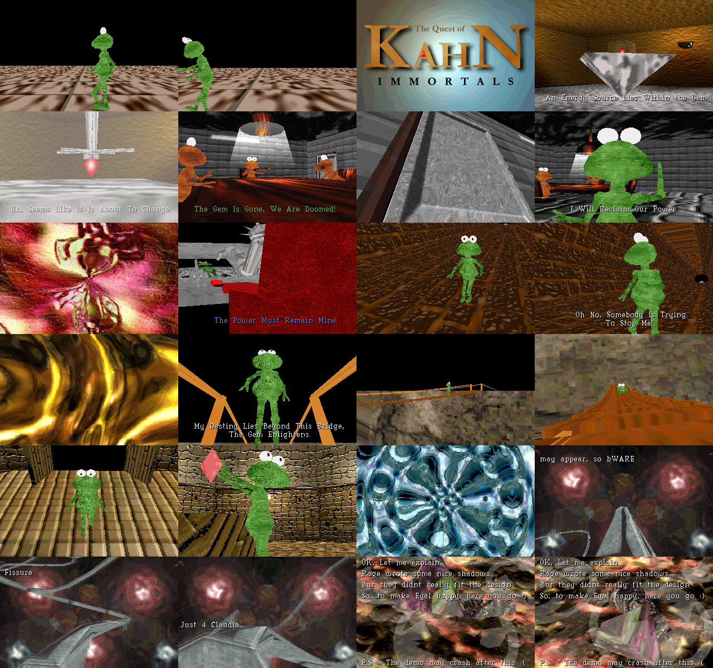

# The Quest of Kahn — in a browser

**▶ [Watch it in your browser](https://gmegidish.github.io/demoports/Quest_of_Kahn_by_The_Immortals/)** · press **F** for fullscreen

*The Quest of Kahn* is a demo by Immortals, first place at Ritual '97, written for MS-DOS in about a week and a half. A green creature's tribe loses the gem that powers its world; Kahn goes after it, through a tunnel, over a rope bridge, into the villain's hall. Textured 3D from 3D Studio scenes, a tracker module, and a roller-coaster built in code for the credits.

This repository rebuilds it in a browser, from the original files: the nine `.3DS` scenes, the textures, the font and the music that shipped next to `KAHN.EXE`. The picture is composed the way the original did it: a 320×200 buffer of palette indices and a 6-bit VGA palette, software-rendered on the CPU, put on screen by a 2D canvas. No WebGL, no libraries. Same scenes, same textures, same music, same tick counts.

There is no source code for The Quest of Kahn. The engine and every scene script were read out of the executable.

The whole port was written by [Claude Code](https://claude.com/claude-code): disassembling the executable, reading it in nine slices, matching the rasteriser against the machine code in an emulator, porting it, and this README.



*Twenty-four moments, in order. Rendered headless by `tools/poster.mjs`: no browser, no screenshots.*

## Run

```bash
python3 -m http.server 8000
# open http://localhost:8000/
```

| Key | Action |
|---|---|
| Click | Start |
| **F** | Toggle fullscreen |
| ← / → | Seek 5 s |

Add `#t=120` to the URL to start 120 s in. Add `#hud` to show the clock.

```bash
npm test                                   # 106 tests, about six seconds
node tools/shot.mjs /tmp/kahn 30 95 250    # render three moments to PNG, no browser
node tools/poster.mjs                      # renders docs/poster.png
```

## Credits

*The Quest of Kahn*, Immortals, 1997. From `KAHN.NFO`: code by Kombat and Rage, graphics by Thor, music by Dark-Spirit, font copied from Warcraft II by Silvatar. Music player: MIDAS, by Petteri Kangaslampi and Jarno Paananen. All graphics and music belong to their authors.

The port, the tools and this README were written by [Claude Code](https://claude.com/claude-code).

## What is in the executable

`KAHN.EXE` is a Watcom C++ linear executable bound to DOS/4GW: 240 KB of code, 64 KB of data.

- **A 3D Studio keyframer player.** Meshes, cameras and lights from the `.3DS` editor chunks; position, rotation, scale, hide, roll and field-of-view tracks from the keyframer chunks, interpolated with 3D Studio's tension/continuity/bias splines. Rotations are not slerped: the loader accumulates each key into an absolute quaternion and its four components go through the same spline as a position.
- **No lighting.** Nothing in the engine computes a shade. What looks lit is textures, environment mapping from the view-space vertex normal, and 64 KB lookup tables that mix two palette colours: additive for the flares, 15/85 for glass, a brighten ramp for the lamp's cone and for the shadows.
- **Object names are the material system.** A mesh named `…prs` gets the perspective-correct texture mapper, `…env` gets environment mapping, `…cul` is two-sided, `…spc` goes to whatever special drawer the current part uses. The test is case-sensitive, so `Ceilig,Prs` is not a perspective object.
- **The engine only sorts.** Each part of the demo walks the sorted face list itself, far to near, and picks a drawer per face. Big flat meshes are kept out of the list and drawn first.
- **A hand-written rasteriser.** Perspective spans divide once every 16 pixels and step texels linearly in 8.8 between; affine triangles for everything small; a scaled sprite for the flares. No z-buffer, no sub-pixel correction, both edge pixels of every span drawn.
- **One clock.** MIDAS calls a function 100 times a second; it increments two counters. Every part is a loop that runs until a counter passes its length, then subtracts that length, so a slow frame never accumulates drift.

Two of the textures, `2DTEST2.GIF` and `2DTEST3.GIF`, are PCX files with the wrong extension. The loader tries GIF, then PCX.

## The parts

Times are from the start of the music. The demo is 6:24.5 long; the module is 4:52 and loops under the end scroller.

| Time | Part | Scene |
|---|---|---|
| 0:00 | The creature walks in, then the title | `CREAT.3DS`, `LOGO.GIF` |
| 0:28 | A mechanical hand steals the gem | `FIRSTS.3DS` |
| 0:45 | The meeting: "Call Kahn" | `SECONDS.3DS` |
| 1:12.8 | Wobbler 1 | `2DTEST.GIF` |
| 1:18.5 | The villain: "The Power Must Remain Mine" | `BADDY.3DS` |
| 1:24.2 | Kahn in the tunnel, chased by a car | `HITCAR.3DS` |
| 1:48.2 | Wobbler 2 | `2DTEST2.GIF` |
| 2:03.2 | The bridge, with the villain cut in | `BRIDGE.3DS`, `BADDY2.3DS` |
| 2:34 | Kahn finds the gem | `BADGUY.3DS` |
| 3:03 | Wobbler 3 | `2DTEST3.GIF` |
| 3:13.5 | Roller-coaster and end scroller, 78 lines | built in code |
| 5:49.5 | Shadows | `CRED.3DS` |

## How it was read

1. Unpack the linear executable and apply its 8,894 relocations (`tools/re/le.py`), then disassemble by recursive descent from the entry point and every relocated code pointer (`tools/re/kdis.py`).
2. Find `main` from its strings. It sets 320×200, calls thirteen loaders, starts the music, calls twelve parts.
3. Read the executable in nine slices and write each one down as pseudo-code: `docs/disassembly/`. The assumptions the slices were handed were wrong in several places, and the notes say where: the function assumed to render only sorts, the two 7 KB functions assumed to hold inner loops hold none, the "2D effects" slice turned out to be the rasteriser.
4. For the rasteriser, the reader went further: Python models of each routine, run against the original machine code in an emulator on about 10,000 random triangles, trapezoids and sprites until every byte matched (`tools/re/models/`).
5. Port from the notes. Each blocking routine of the original is a JavaScript generator that yields once per frame shown.

## What is verified, and what is not

Verified:

- **Rasteriser:** byte-identical to the emulator-checked models on 1,200 random cases (`test/raster.test.js`).
- **Pictures:** all 62 textures decode to the same pixels and palette as Pillow.
- **Scenes:** all nine load with the frame ranges, face, light and camera counts found by an independent parse.
- **Whole demo:** runs headless from the loading screen to the black screen at 6:24.5.
- **Browser:** module loading, the 70 file fetches, canvas output and music decoding were exercised in Chrome; a frame costs about 4 ms.

Not verified:

- **Against the original running.** No capture of the real demo was compared. Everything above the rasteriser (clipping, keyframer, scene scripts) is ported from notes made by reading disassembly, and is checked only by looking at the frames.
- **The roller-coaster camera.** The code lifts the camera 500 units off a tube of radius 200, so the tube is seen from outside. That is what the executable computes as read; whether it looks like this on a PC is unconfirmed.
- **Sound latency.** The music starts the moment the original calls MIDAS. A real sound card's mixing buffer would delay it slightly.
- **Real-time playback in a visible tab** was not watched end to end.

Known differences from the original:

- The last two parts zero the tick counters when they start; the port keeps the few ticks the previous part overran, as every other part does, so that seeking lands in the right place.
- After a seek the keyframer is evaluated repeatedly before the first frame is drawn, because its cursors advance one key per call. The original has no seeking; its ESC key skips ahead and glitches for a few frames.
- One span quirk is reproduced on purpose: the opaque perspective filler draws 16 pixels for a span of zero width.

## Layout

```
index.html              the page
src/main.js             fetches the files, drives the demo from the music's clock
src/demo.js             main(): load order, part order
src/machine.js          screen, work buffers, DAC, tick counters
src/parts/              one file per part of the demo
src/engine/scene.js     the .3DS loader and the data model
src/engine/track.js     the keyframer
src/engine/frame.js     animate, transform, cull, sort
src/engine/triangle.js  near clip, projection, screen clip, edge setup
src/engine/raster.js    the span fillers: everything that writes a pixel
src/tables.js           colour-mixing lookup tables
src/font.js, gif.js, picture.js, screen.js
assets/music.ogg        DUCKSIN.XM rendered with libopenmpt
docs/disassembly/       the notes the port was written from
tools/re/               the disassembly tools and the emulator-checked models
tools/poster.mjs        renders docs/poster.png
```

The music is rendered once, then encoded:

```bash
openmpt123 --render --samplerate 44100 --channels 2 ducksin.xm
ffmpeg -i ducksin.xm.wav -c:a libopus -b:a 160k assets/music.ogg
```
