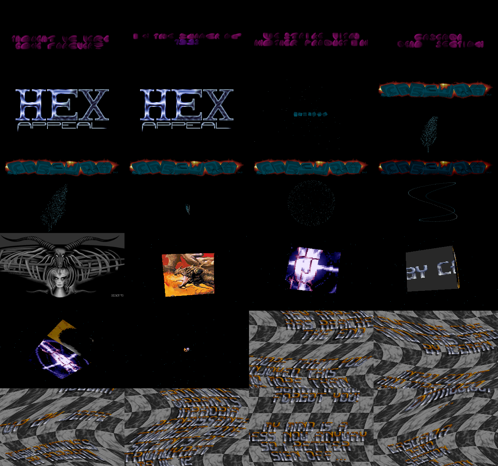
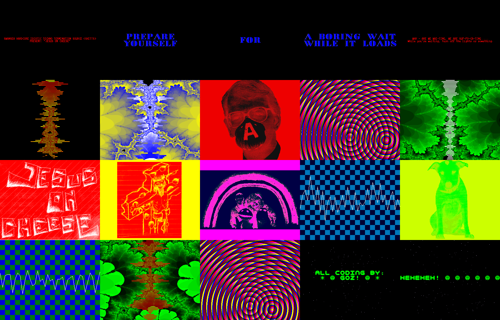
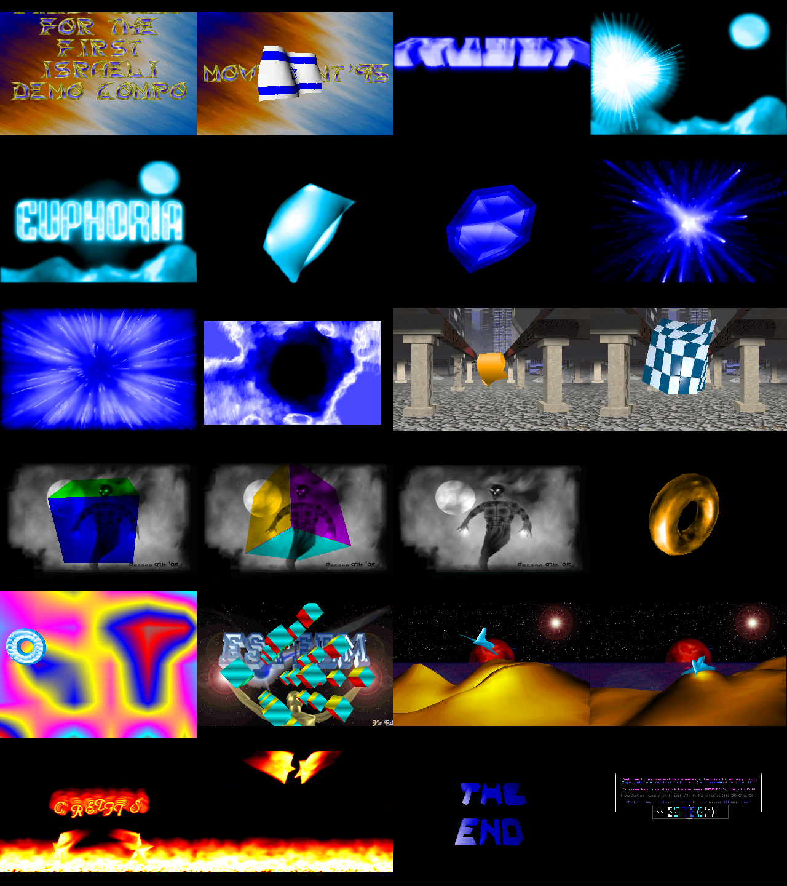
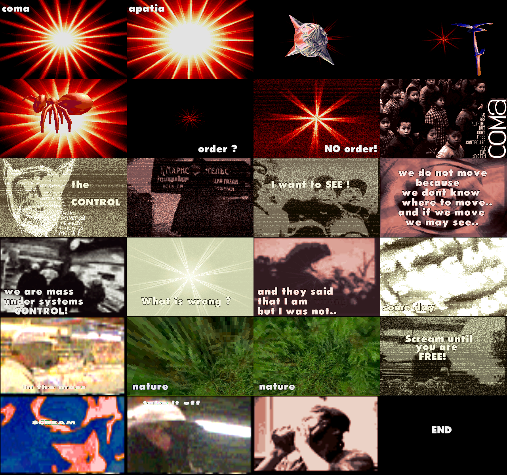
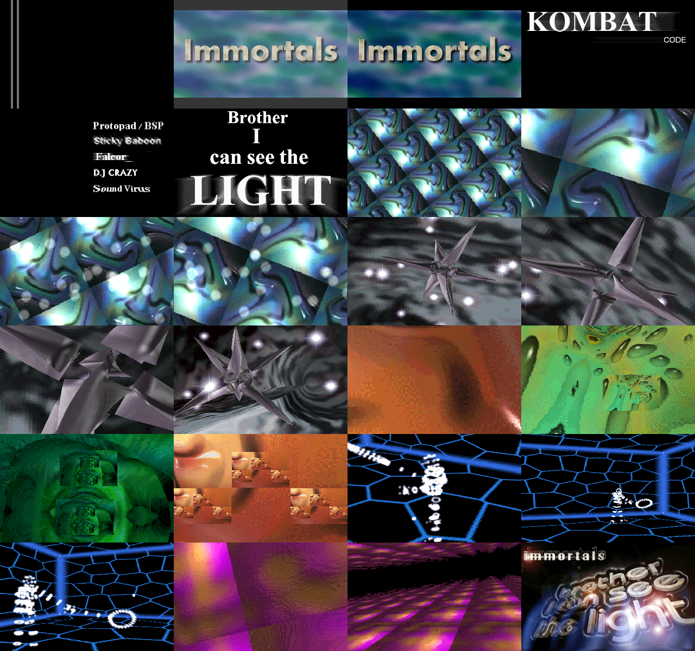
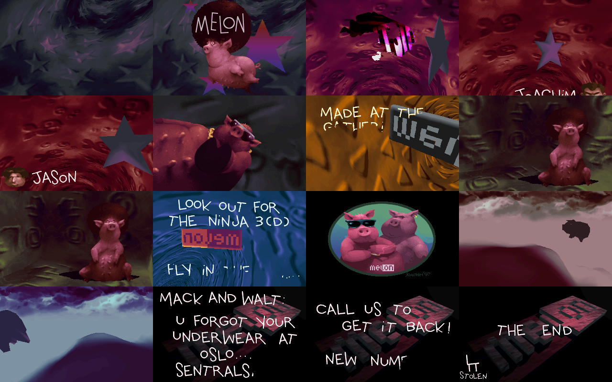
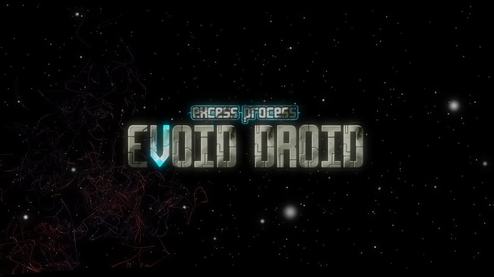

# demoports

Demos have been a large part of my life. Each of the demos below is curated by me, to relive these moments when I was 
a kid, rushing back home from school and dial up one of the local BBS's and hope that a new demo has landed. And then
I would watch on repeat, how did they do that? how is it so fast? Games back then weren't as fast, so how these wizards
pull these things off?

Each of the demos here mean something to me, that's why I chose to port these. The work was done mostly by Claude Code with
Opus 5.5 and Fable 5.1 models. I review each one of them, and compared captures taken by various people on YouTube, to make
sure it matches the original as closely as possible. Nothing beats the real hardware, this is not a replacement. But this is
also not emulation, it's rewritten to play at the right speed on your browser, mimicing copper effects and crtc quirks. The
code will set these values, and an engine would render the graphics.

I'm tempted not to look at the code. Some of the things here are still magic to me, and I'd like to keep this mystery for a
little longer.

-- Gil, Oct 2026

| Demo | Group | Year | Platform | |
|---|---|---|---|---|
| Hex Appeal | Cascada | 1993 | MS-DOS | [src](https://github.com/gmegidish/demoports/tree/main/Hex_Appeal_by_Cascada) · [play](https://gmegidish.github.io/demoports/Hex_Appeal_by_Cascada/) |
| The Good, the Bad & the Ugly | Surprise! Productions | 1993 | MS-DOS | [src](https://github.com/gmegidish/demoports/tree/main/The_Good_the_Bad_and_the_Ugly_by_Surprise_Productions) · [play](https://gmegidish.github.io/demoports/The_Good_the_Bad_and_the_Ugly_by_Surprise_Productions/) |
| Jesus on Cheese | S.H.I.T.T.S. | 1993 | Amiga 500 | [src](https://github.com/gmegidish/demoports/tree/main/Jesus_on_Cheese_by_Shitts) · [play](https://gmegidish.github.io/demoports/Jesus_on_Cheese_by_Shitts/) |
| Baygon | Melon Dezign | 1995 | Amiga 1200 | [src](https://github.com/gmegidish/demoports/tree/main/Baygon_by_Melon_Dezign) · [play](https://gmegidish.github.io/demoports/Baygon_by_Melon_Dezign/) |
| Euphoria | Esteem | 1995 | MS-DOS | [src](https://github.com/gmegidish/demoports/tree/main/Euphoria_by_Esteem) · [play](https://gmegidish.github.io/demoports/Euphoria_by_Esteem/) |
| Ninja 2 | SCOOP & Melon | 1996 | MS-DOS | [src](https://github.com/gmegidish/demoports/tree/main/Ninja_2_by_Melon_and_Scoop) · [play](https://gmegidish.github.io/demoports/Ninja_2_by_Melon_and_Scoop/) |
| The Control | Coma | 1996 | MS-DOS | [src](https://github.com/gmegidish/demoports/tree/main/The_Control_by_Coma) · [play](https://gmegidish.github.io/demoports/The_Control_by_Coma/) |
| The Quest of Kahn | Immortals | 1997 | MS-DOS | [src](https://github.com/gmegidish/demoports/tree/main/The_Quest_of_Kahn_by_Immortals) · [play](https://gmegidish.github.io/demoports/The_Quest_of_Kahn_by_Immortals/) |
| Brother I Can See The Light | Immortals | 1997 | MS-DOS | [src](https://github.com/gmegidish/demoports/tree/main/Brother_I_Can_See_The_Light_by_Immortals) · [play](https://gmegidish.github.io/demoports/Brother_I_Can_See_The_Light_by_Immortals/) |
| Outside | Melon Dezign | 1997 | MS-DOS | [src](https://github.com/gmegidish/demoports/tree/main/Outside_by_Melon) · [play](https://gmegidish.github.io/demoports/Outside_by_Melon/) |
| Evoid Droid | Excess & Portal Process | 2007 | Xbox 360 | [src](https://github.com/gmegidish/demoports/tree/main/Evoid_Droid_by_Excess_Process) · [play](https://gmegidish.github.io/demoports/Evoid_Droid_by_Excess_Process/) |

## Hex Appeal — Cascada

## The Good, the Bad & the Ugly — Surprise! Productions

## Jesus on Cheese — S.H.I.T.T.S.

## Baygon — Melon Dezign

## Euphoria — Esteem

## Ninja 2 — SCOOP & Melon

## The Control — Coma

## The Quest of Kahn — Immortals

## Brother I Can See The Light — Immortals

## Outside — Melon Dezign

## Evoid Droid — Excess & Portal Process

