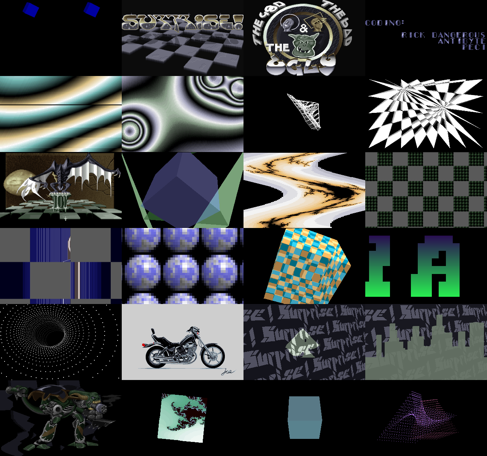

# The Good, the Bad & the Ugly — in a browser

**▶ [Watch it in your browser](https://gmegidish.github.io/demoports/The_Good_the_Bad_and_the_Ugly_by_Surprise_Productions/)** · press **F** for fullscreen

*The Good, the Bad & the Ugly* is a demo by Surprise! Productions (S!P), second at The Party '93 in Herning, Denmark; this is the final version of 7 January 1994. It runs seven and a half minutes on a 286 and plays its music only through a Gravis Ultrasound: a text screen that turns into two spinning cubes, a Surprise! logo over a chessboard, credits that fly apart pixel by pixel, two plasmas, morphing wire grids, a chess warp, a dragon over water, a glentz, a picture wobbler, a chessboard of green balls with parallax bars and zooming spheres, a glentz cube made of chess squares, the greetings, a dot tunnel, a motorcycle, transforming shapes, a contour city, a rotating door, four zooming pictures, a rotating fractal zoomer, glentz and jelly cubes, and 3200 dots. The music is "Beastsong" by Fred.

This repository rebuilds it in a browser from the original file, `GBU.EXE`. The browser unpacks the program, puts it into a megabyte of real-mode memory at the addresses it was written for, and runs the demo's code against that memory, one vertical retrace at a time, as its timer interrupt did. Video goes through a VGA modelled at register level, and a scanline beam for the effects that rewrite registers between lines. The picture reaches the screen through a 2D canvas. No WebGL, no libraries.

There is no source code for the demo. The program was unpacked, disassembled and read.

The whole port was written by [Claude Code](https://claude.com/claude-code): unpacking, disassembling, reading the program in eight slices, recording the original in an emulator to compare against, porting, and this README.



*Twenty-four moments, in order. Rendered headless by `tools/poster.mjs`: no browser, no screenshots. The 320x400 and 640x400 scenes are scaled down.*

## Run

```bash
python3 -m http.server 8000
# open http://localhost:8000/
```

| Key | Action |
|---|---|
| Click | Start |
| **F** | Toggle fullscreen |
| ← / → | Seek 5 s |

Add `#t=200` to the URL to start 200 s in, `#hud` to show the clock, `#nosound` to run on the wall clock without the soundtrack.

```bash
npm test                                   # 7 tests
node tools/frames.mjs /tmp/gbu 9500 17000  # render frames (recording frame numbers) to PNG, no browser
node tools/shot.mjs /tmp/gbu 135 242       # the same at soundtrack seconds
node tools/poster.mjs                      # renders docs/poster.png
```

## Credits

*The Good, the Bad & the Ugly*, Surprise! Productions, 1993. From `GBU.NFO`: front-end coding, demo linking and additional design by Erik Pojar (formerly Rick Dangerous); music by Fred; graphics by Maestro and J.O.E; coding and additional design by Antibyte; coding by Peci. Textmode routines Peci; intro Erik, graphics Maestro; credits Antibyte; plasma and cyclic plasma Erik; morphing line figures Peci; chess effect Erik; water effect Erik, graphics Maestro; glentz vector, picture wobbler, chess parallax zoomer, parallax bars with chess plane, zooming 16x16 pictures and glentz chess cube Erik; greetings scroller Peci; dot tunnel Antibyte; picture of motorcycle J.O.E; transforming objects, contour city and rotating door Erik; picture zoomer Erik, graphics Maestro; rotating fractal zoomer, two glentz cubes and jelly cubes Erik; 3200 dots cubes Antibyte; end ANSI Erik. All graphics and music belong to their authors.

The port, the tools and this README were written by [Claude Code](https://claude.com/claude-code).

## What is in the file

`GBU.EXE` is three things back to back:

- **The program**, packed with LZEXE 0.91 under a renamed signature ("MyLZ" where LZEXE writes "LZ91"). Unpacked it is 80 KB of hand-written real-mode assembly, one segment per module: the main script, a library (resource loader, memory, a GUS MOD player), a video library, the timer, and the effects. Two effects keep their code in the data: the picture zoomer's 100 generated span scalers and the fractal zoomer's renderer are loaded from the file like any picture.
- **The music**, `inc\b2.mod`: "Beastsong", a 4-channel ProTracker module.
- **49 resources**, read by name: pictures (RLE packed), palettes, sine and path tables, the city's height lines, the fonts, the end screen. The table of names, offsets and sizes is inside the program; the last resource ends on the file's last byte.

**One clock.** The timer is reprogrammed so that its interrupt comes just before every vertical retrace: the handler waits for the retrace, restarts the timer with the measured frame length, counts the frame and ticks the music player. Every mode the demo uses runs at 70.086 Hz, so the whole demo runs on the retrace, music included: one player tick per frame, 11 ticks per row. Effects that need the CPU between retraces switch to the BIOS timer and tick the music themselves.

**The music drives the effects.** The song carries `8xx` commands, which ProTracker ignores; the player counts them. The intro waits for the first before the GBU logo, the plasma ends on the third, the cyclic plasma fades out on the fourth, the chess warp ends on the fifth, the picture wobbler on the sixth.

## The effects

Times are from the switch to graphics after the start key, in seconds of the recording.

| Time | Effect | Mode |
|---|---|---|
| 0:00 | Textmode routines: the DOS screen as 640x400 graphics, two blue cubes | 640x400, 16 colours |
| 0:08 | Intro: chess plane, the Surprise! logo, yellow pyramid, "presents", the GBU heads | 320x200/400, 16 and 256 colours |
| 0:33 | Credits: pages that fly apart into pixels and reassemble | 320x200, 16 colours |
| 0:53 | Plasma, its 99 rows moved one by one through the CRTC | 320x400, 256 colours |
| 1:13 | Cyclic plasma | 320x400, 256 colours |
| 1:33 | Morphing line figures | 320x200, 16 colours |
| 1:50 | Chess effect | 320x200, 16 colours |
| 2:04 | Water: the dragon over a reflecting chess floor, rippled line by line | 320x400, 256 colours |
| 2:24 | Glentz vector | 320x200, 16 colours |
| 2:37 | Picture wobbler, dissolving into green blocks | 320x200, 256 colours |
| 2:54 | Chess parallax zoomer, parallax bars with chess plane, zooming 16x16 pictures | 320x400, 16 colours with Color Select per line |
| 3:51 | Glentz chess cube | 320x200, 16 colours |
| 4:12 | Greetings scroller | 320x200, 16 colours |
| 4:28 | Dot tunnel | 320x200, 16 colours |
| 4:54 | Motorcycle, transforming objects, contour city, rotating door | 320x200, 16 colours |
| 5:28 | Picture zoomer: four pictures and a wobbling robot | 320x200, 256 colours |
| 5:51 | Rotating fractal zoomer | 320x200, 256 colours |
| 6:13 | Two glentz cubes, jelly cube | 320x200, 16 colours |
| 6:52 | 3200 dots cubes | 320x200, 16 colours |
| 7:34 | Music fade, then the end screen | text |

## How it was read

1. Unpack: run the packer's stub in Unicorn at two load segments and diff the memory for the relocations; later written as `src/mylz.js`, which reproduces that memory byte for byte. Extract the resources from the table inside the program.
2. Record the original in DOSBox Staging with a Gravis Ultrasound at 60000 cycles (a second run at 200000 cycles matched frame for frame except four CPU-bound loading pauses, so the demo is not short of CPU at 60000).
3. Read the program in eight slices: the framework (main script, player, timers, video library, packer) and seven groups of effects, written down as pseudo-code in `docs/disassembly/`. Every reader checked the reading against the recording, most by writing a Python model that reproduced their effects frame for frame.
4. Port: the same eight readers ported their slices onto a common engine.
5. Compare the whole demo with the recording, frame by frame, and fix the state that passes from one effect to the next: the 3D engine's angles and pages, the random generator the wobbler leaves to the chess zoomer, the attribute controller's flip-flop, and where the music gains or loses a tick when an effect changes the timer.

## How the port works

**Not an emulator.** No x86 is interpreted. Each routine was rewritten in JavaScript from the notes, but it keeps the original's data where the original kept it. `GBU.EXE` is unpacked into a 1 MB `Uint8Array` at segment 0, so every address in `docs/disassembly/` is the address in the port: `08d8:275d` is `m.mem[0x8d80 + 0x275d]`. Tables, variables and self-modified immediates stay at their addresses; resources are loaded into DOS-style memory blocks, and the memory lives through the whole demo, as it did. The 3D engine shared by eight effects keeps its angles, pages and fill buffers there, so each effect starts from what the previous one left.

**One generator per effect.** `src/demo.js` is the main script, line by line: loads, frees, clears, mode sets and the effects in order. Each effect is a generator, and `yield` is a wait for the vertical retrace. At each retrace the frame loop latches the display, runs the timer interrupt as the installed handler would (frame counter and music tick, music only, or nothing under the BIOS timer), then resumes the code. The music is a silent sequencer of the player (`src/song.js`): no sound is synthesised, but the effects get the same `8xx` sync count at the same tick as the original.

**A VGA at register level, with a beam.** `src/vga.js` holds the four planes, the latches, write modes, map mask, bit mask, set/reset, and the sequencer, graphics, CRTC, attribute and DAC registers; the effects' `out` instructions become `vga.out8`/`vga.out16` with the same ports and values. The screen is worked out from the registers (`src/screen.js`): start address, offset, line compare, maximum scan line, pel panning, chain-4 or planar, the attribute palette, Color Select and P54S, the DAC, screen off. Several effects change the picture while it is being drawn: the plasma and the water set the CRTC offset on every line, the chess zoomer sets Color Select on every line and draws its bars into the line being shown, the greetings change the offset and a colour per line. For those the effect counts its horizontal-retrace waits and the VGA draws the lines the beam has passed before each change. The rule for where a change lands was measured in the recording.

**Like a VGA card, not like DOSBox.** The reference recording is DOSBox, and in two places DOSBox shows something a VGA card does not. There the port follows the card:

- DOSBox draws the 16-colour modes from its own copy of video memory, which writes made in a 256-colour mode do not reach. Around the morphing lines' box DOSBox shows the plasma's old picture as noise; the demo cleared that memory, and on a VGA card it is black.
- DOSBox's palette for 256-colour modes ignores colours written while the card is in a 16-colour mode. The chess effect sets colours 60 to 62 to white that way, and the water uses them for the highlights of the dragon's wings: white on a VGA card, almost black in DOSBox.

Elsewhere the port follows DOSBox where it can't know better: a change of mode or line height shows one frame after it is made, and the plasma and the parallax bars, which run without waiting for the retrace, tear where they did in the recording. The port models their scanline cost; the plasma uses the tick lengths measured in the recording.

**Music as a clock.** The soundtrack is the recording's audio, and the page runs the demo up to the audio's `currentTime`. Before the GUS starts there is no music; the recording's first tick is 8.3 s in.

**Seeking.** A seek forward runs the retraces in between; the whole demo takes about 6 seconds in node. A seek back starts again from the first effect, because the effects keep their state from frame to frame.

**Size.** The engine is about 2,900 lines (VGA, screen, memory, unpacker, song, library, 3D engine, page) and the effects about 6,300. The page loads `GBU.EXE` (the original file, unmodified), the VGA BIOS font for the end screen, and a 3.9 MB Opus soundtrack.

## What is verified, and what is not

Verified:

- **Against the original running, every frame:** the port was rendered for each of the recording's 32744 frames and compared byte for byte. 27895 are identical, and 2615 more differ on purpose, in the two effects where the port shows what a VGA card shows (above). `test/original.test.js` checks one frame in each effect in a single run of the demo.

  | Effect | Identical frames |
  |---|---|
  | Text screen, blue cubes, fade | 582 of 584 |
  | Intro | 1707 of 1711 |
  | Credits | 1394 of 1394 |
  | Plasma | 636 of 1457 |
  | Cyclic plasma | 1336 of 1337 |
  | Morphing line figures | 0 of 1203 (black background, as on a VGA card) |
  | Chess effect | 970 of 984 |
  | Water | 9 of 1421 (white wing highlights, as on a VGA card) |
  | Glentz vector | 911 of 911 |
  | Picture wobbler | 1182 of 1191 |
  | Chess zoomer, parallax bars, spheres | 3381 of 4015 |
  | Glentz chess cube | 1452 of 1452 |
  | Greetings | 1227 of 1227 |
  | Dot tunnel | 1691 of 1691 |
  | Motorcycle to rotating door | 2407 of 2407 |
  | Picture zoomer | 1654 of 1655 |
  | Rotating fractal zoomer | 1479 of 1479 |
  | Glentz and jelly cubes | 2737 of 2737 |
  | 3200 dots cubes | 2950 of 2950 |
  | Music fade | 190 of 191 |

- **Timeline:** the six music syncs, every effect's first and last frame, and the switch to the end screen land on the recorded frames.
- **The unpacker:** `src/mylz.js` gives the same memory as the packer's own stub run in an emulator.

Not the same as the recording, and why:

- **The plasma (821 frames).** It runs 396 scanlines per loop, not one frame, so its tear drifts up the screen. How long each GUS music tick took in DOSBox moves the tear by a line; the port uses the lengths measured for 117 of the loops and a rule for the others, and about half the frames still have one or two lines in a different place.
- **The parallax bars (about 560 frames).** The same kind of drift: from frame 14413 the bars in the recording stay locked to the end of the frame four frames longer than the port's scanline model, and the rest of the effect is one line off.
- **Mode switches (about 20 frames).** DOSBox shows a frame half old, half new where the code changes the mode or the palette mid-frame, and once a garbled frame (the first one, from the DOS screen).
- **The end screen.** DOS's blinking cursor under the prompt is not drawn.
- **Fitted timing.** Three pauses are CPU or disk bound in DOSBox and are measured, not derived: the GUS detection and module upload before the music, the dot tunnel's precalculation, and the motorcycle's pattern rendering.
- **The DOS screen before the start.** The demo first fades the DOS prompt and redraws it as graphics; the port starts at that redraw, with an empty screen.
- **Music.** The soundtrack is the recording's audio: the demo's own player on an emulated Gravis Ultrasound.

## Layout

```
index.html                 the page
src/main.js                fetches GBU.EXE, the font and the soundtrack; runs the demo on the soundtrack's clock
src/mylz.js                the LZEXE 0.91 ("MyLZ") unpacker
src/gbu.js                 the resource table
src/demo.js                the main script and the retrace-paced frame loop
src/machine.js             real-mode memory, DOS memory blocks, resource loading, the timer interrupt
src/song.js                the MOD player's sequencer, silent: position and the 8xx sync counter
src/library.js             the video library (segment 0299) and the palette fades
src/vga.js                 the VGA at register level, the beam, DOSBox's display rules
src/screen.js              what the monitor shows, line by line, from the registers
src/engine3d*.js           the 3D engine of segment 08d8: projection, XOR lines, parity fill, pages
src/parts/                 the effects, one or more files each
assets/soundtrack.ogg      the recording's audio
assets/vgafont.bin         the VGA BIOS 8x16 font, for the end screen
docs/disassembly/          the notes the port was written from
tools/re/                  the unpacking and disassembly tools
tools/frames.mjs, shot.mjs, poster.mjs   render frames and docs/poster.png headless
```
